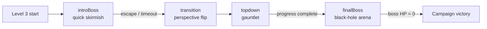
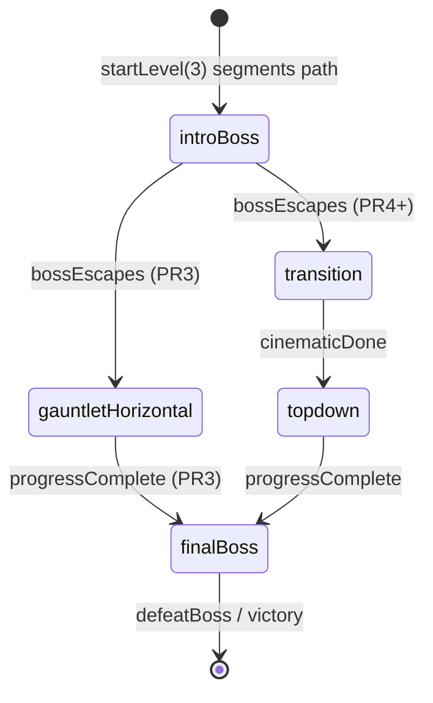
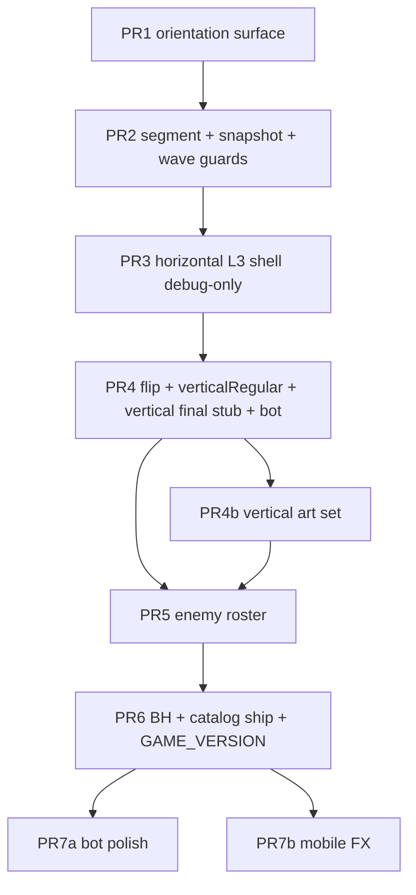

# Level 3 Design — NovaWing: SINGULARITY RUN

| Field | Value |
|-------|--------|
| **Document** | Level 3 Design — NovaWing (rtype-prototype) |
| **Author** | TBD |
| **Date** | 2026-07-26 |
| **Status** | Draft (rev 2.3 — product decisions locked) |
| **Workspace** | `/home/adam/rtype-prototype` |
| **Primary files** | `levels.js`, `game.js`, `scripts/rl/obs-encode.mjs`, `scripts/play-bot.mjs` |

---

## Overview

Level 3 is the campaign finale: an **epic multi-segment stage** that opens with a **quick boss skirmish**, then **flips the game into top-down vertical flight**, runs a long gauntlet of new aerial enemies, and ends with a **full rematch against the same boss** in a **black-hole arena**.

NovaWing is a **Phaser 3 2D canvas** shmup (`game.js` ~5.8k lines). “Top-down” and “perspective flip” are **camera/control/art remaps**, not true 3D. The design extends existing authoring (`defineLevel` in `levels.js`) and combat systems (`gamePhase`, wave patterns, boss phases, `getBotSnapshot`) rather than rewriting the engine. The current binary phase model (`waves` \| `boss`) is insufficient; Level 3 introduces a **level segment state machine** layered on top of combat mode, with an **explicit integration contract** into `startLevel`, `update`, `startBossFight`, and `defeatBoss`.

**Shipping rule:** `LEVEL_3` is **not** appended to `LEVEL_DEFS` until the full loop (intro → flip → gauntlet → final kill) is playable. WIP development uses `?level3=1` / debug registry injection so L1→L2 campaign completion and leaderboard victory semantics stay intact during intermediate PRs.

---

## Background & Motivation

### Current state

| Level | Name | Shape |
|-------|------|--------|
| 1 | OPEN SPACE | Classic horizontal; fixed camera Y; `durationMs: 60000`; no path walls |
| 2 | THE CANYON | Tall world (`worldHeight: 1500`); `cameraFollowY`; authored multi-path walls |

Level flow today (`game.js`):

```
create / startLevel → gamePhase = 'waves', levelProgressMs = 0
  → delayedCall: levelTransitioning = false; scheduleNextEnemyWave()
  → update: when gamePhase === 'waves', progress vs levelDef.durationMs
  → remainingMs <= 0 → startBossFight()  // requires gamePhase === 'waves'
  → gamePhase = 'boss' → hitBoss → defeatBoss() → next level or victory
```

Relevant constants and hooks:

- Registry: `LEVEL_DEFS = [LEVEL_1, LEVEL_2]`; `TOTAL_LEVELS = LEVEL_DEFS.length`
- Authoring: `defineLevel()` fills defaults (`cameraFollowY`, `bossHealth`, `powerups`, `wavePatternKeys`, …)
- Combat phases: `gamePhase ∈ {'waves','boss'}` only
- Scroll: entities use `baseVelocityX` (negative = left); `updateScrollVelocity()` applies boost
- Player: free 8-way velocity via `getMovementAxes()`; bullets always fire **+X** (`fireBullet` → `velocityX ≈ 630–690`)
- Boss: shared archetype (`bossShip`), phases 1–3 at 100% / 67% / 34% of **levelDef.bossHealth**
- Wave patterns: `getLevelWavePatterns()` — **empty array `[]` currently means ALL patterns** (same as null-ish empty check on `.length`)
- Bot/RL: `getBotSnapshot()` + `obs-encode.mjs` encode `phase` as waves/boss flags only; play-bot uses `HOME_X = 100`, `BOSS_X = 140`

### Pain points / why Level 3 needs design

1. **Binary `gamePhase`** cannot express intro-boss → transition → top-down → final-boss without ad-hoc hacks.
2. **Horizontal-only assumptions** span spawn, fire, cleanup, tracking, trails, boss entry — not just scroll helpers.
3. **Same boss twice** needs distinct encounter scripts and a single health/phase source of truth.
4. **Black-hole spectacle** needs a cheap Phaser FX budget with defined update order and hazard FSM.
5. **Bot/RL and mobile** break if vertical geometry lands without pilot/snapshot updates.
6. **Catalog ship timing**: appending incomplete `LEVEL_3` moves victory/TOTAL_LEVELS mid-stack.

---

## Goals & Non-Goals

### Goals

1. Deliver the user vision: **intro boss → perspective flip → top-down gauntlet → same boss at black hole**.
2. Keep Level 3 **authorable** via `levels.js` extensions (segments, powerups, wave keys, boss encounter profiles).
3. Prefer **incremental** changes to `game.js` systems (scroll axis, fire vector, phase machine, arena forces).
4. Preserve campaign wiring: L1/L2 stay the live campaign until L3 is complete; then `TOTAL_LEVELS` grows and final boss gates victory.
5. Remain **testable**: debug skip, play-bot snapshots, mobile touch axes still usable.
6. Ship via **small, mergeable PRs** that never leave the **default** campaign incomplete (see PR Plan + K11).

### Non-Goals

- True 3D, camera FOV, or WebGL distortion pipelines beyond Phaser graphics/tweens.
- Rewriting Level 1/2 feel or retiring horizontal mode.
- Full RL policy retrain as a release blocker (obs compatibility called out; train as follow-up).
- New weapon types or combo meter (orthogonal; may reuse existing powerups only).
- Multiplayer / co-op.
- Separate Phaser scene for top-down (see Alternatives).
- **New music loop** for top-down (product decision: reuse existing waves track; transition stinger only).

---

## Key Decisions

| # | Decision | Rationale |
|---|----------|-----------|
| **K1** | Introduce `levelSegment` state machine **orthogonal** to combat mode | Keeps existing `waves`/`boss` combat logic reusable while expressing L3 structure. Avoids overloading `gamePhase` with five values that break every `=== 'waves'` guard. |
| **K2** | Top-down = **vertical-forward 2D remap**: nose **up**, fire **−Y** (toward top of screen), world scroll **down** (entities have `baseVelocityY > 0` when approaching from ahead) | Matches classic vertical shmups; player “flies up” into deep space. Cleaner than rotating the whole camera 90° (breaks HUD, touch, hitboxes). Fire is **negative Y**, not +Y. |
| **K3** | Enemies primarily approach **from ahead** (spawn above, fly down). Secondary “riser” types come **from below** | Satisfies “flying up / from below” for specialty threats while primary threat comes from direction of travel. |
| **K4** | Perspective flip is a **scripted cinematic segment** (~3.5s): clear field, invuln, camera zoom/rotate flourish, then remap | Mid-transition live combat is unreadable and breaks bots. Hard reset of groups is already the pattern in `startBossFight` / `startLevel`. |
| **K5** | One boss **entity archetype**, two **encounter profiles** (`intro` vs `final`) in level data | Reuses `bossShip`, volleys, drones, lasers; differs health, allowed phases, arena forces, escape/defeat scripts. |
| **K6** | Intro boss **escapes** (does not die): timeout or HP threshold → transition | Guarantees the flip always happens; narrative “escaped to the singularity.” Final fight is the real kill. |
| **K7** | Black-hole gravity is a **radial force field** applied in `update` **after** `player.setVelocity`, **player-only in v1** | Arcade control remains readable; pull is not wiped by input; works with existing Arcade velocity sets. Boss immune; optional bullet drift later. |
| **K8** | No path walls on L3 (`hasPathWalls: false`) | Top-down + black hole already constrain space; canyon walls fight free flight. |
| **K9** | Orientation surface: `scrollMode` + helpers `isOffscreen`, `spawnAhead`, `getApproachVelocity`, `getEnemyFireVector`, `getPlayerFireVector`, `updateScrollVelocity` | Migrates all horizontal call sites without forking spawn paths. L1/L2 keep horizontal. |
| **K10** | Snapshot gains `segment`, `scrollMode`, `combatOrientation`, `blackHole`, `boss.encounter`, `baseVelocityY` in **PR2**. Minimal **heuristic pilot branch** ships with first vertical play (**PR4**). OBS v2 is a separate follow-up | CI/play-bot can gate vertical segments; formal obs layout bump stays intentional for RL retrain. |
| **K11** | **Catalog gate:** do **not** append `LEVEL_3` to `LEVEL_DEFS_SHIPPED` until PR6. WIP via `?level3=1` / `getEffectiveLevelDefs()` + **live** `getTotalLevels()` / `getLevelDef` (no frozen `const TOTAL_LEVELS` for logic). No `shipped` field on defs — membership is registry contents only | Prevents incomplete L3 from becoming campaign length; avoids game.js load-time TOTAL_LEVELS snapshot footgun. |
| **K12** | **Active-segment config resolution:** `getActiveDurationMs()`, `getActivePowerupPlan()`, `getActiveWavePatternKeys()` prefer current segment fields when `levelSegment != null`; top-level fields are fallbacks for non-segment levels only | Avoids empty top-level `powerups: []` / `wavePatternKeys: []` silently meaning “all patterns / no drops.” Progress advances **only** when `isProgressDrivenSegment()`. |
| **K13** | **Music per segment enter** + **resource persistence:** lives/weapon/boost/shield **persist** across segments; music: introBoss→`boss`, transition→**stinger only** (no new loop), topdown→**reuse existing `waves` track**, finalBoss→`boss` | Product-locked: no new top-down BGM; one life/weapon pool across flip. |
| **K16** | **Ship art target = new vertical art set** (dedicated top-down player + L3 enemy sprites). Early PRs may use temporary rotated/tinted placeholders | Product-locked: reuse-only is not the ship target; placeholders OK until art PR lands. |
| **K17** | **Intro damage does not carry** to final: full HP reset from final profile. **Swallow** = killRadius + spit-out + life loss (not tick-only) | Arcade readability; fair soft-lock avoidance. |
| **K18** | **Timing locked:** top-down ~80–95s; skilled full L3 clear ~3.5–4.5 min (~4 min stage target) | Confirmed product length; do not compress to ~60s gauntlet without new decision. |
| **K14** | **Boss health single source:** `startBossFight(encounterKey)` sets `bossMaxHealth = profile.health` (module var); `getBossPhase` / health bar / escape ratios use **that** max, not raw `levelDef.bossHealth` during the fight | Prevents intro 0.45× HP with bar math against top-level 1.35×. |
| **K15** | Phase-3 lasers default to **vertical lanes** (constant X strips). Radial beams are a stretch goal | Matches Risks preference; remaps cleanly from current horizontal `laneY` lasers. |

---

## Proposed Design

### High-level flow



### Segment timing budget (**locked** — ~3.5–4.5 min skilled clear; ~4 min stage target)

| Segment | ID | Target duration | Progress driver | Exit condition |
|---------|-----|-----------------|-----------------|----------------|
| Intro mini-boss | `introBoss` | 20–35 s | Encounter timer + damage | HP/max ≤ `escapeHpRatio` **or** timeout 35 s **or** overkill |
| Horiz. shell (PR3) | `gauntletHorizontal` | ~20 s | `levelProgressMs` via **`isProgressDrivenSegment()`** | Progress complete → `finalBoss` |
| Perspective flip | `transition` | 3.2–3.8 s | Cinematic timeline | Tween complete → `advanceLevelSegment('topdown')` |
| Top-down gauntlet | `topdown` | 80–95 s | `levelProgressMs` via **`isProgressDrivenSegment()`** | Progress complete → `finalBoss` |
| Final boss | `finalBoss` | open (~45–90 s) | Boss HP | `defeatBoss` (campaign end) |

**Progress clock ownership (K12):**

- `levelProgressMs` is reset to `0` when entering any progress-driven segment (`topdown`, `gauntletHorizontal`, or `progressDriven: true`).
- `update` advances progress **only** when `isProgressDrivenSegment() && gamePhase === 'waves' && !levelTransitioning` — **not** when `levelSegment === 'topdown'` alone.
- `levelProgressMs` is **frozen** (not advanced) during `introBoss`, `transition`, `finalBoss`.
- Top-level `levelDef.durationMs` is documentation/fallback; runtime uses `getActiveDurationMs()` from the active segment.
- Boost multiplies progress **only** while in a progress-driven segment (same formula as today).

### Difficulty curve

1. **Intro boss**: phase-1 missiles only, ~45% of `DEFAULT_BOSS_HEALTH`; escape at 55% of **intro** max remaining (or timeout). Damage does **not** carry to final (**K17** full HP reset).
2. **Early top-down (0–25 s)**: darts + light patterns; wide lanes; generous powerups.
3. **Mid gauntlet (25–60 s)**: risers + strafers; at **progressMs ≥ 60000** enable **black-hole preview** (see Black hole → Preview).
4. **Late gauntlet (60–90 s)**: mixed patterns, orbiters, preview pull 0.25×.
5. **Final boss**: full phases 1–3, elevated HP, full gravity + hazard rings.

### Powerup plan (top-down segment `progressMs`)

Resolved via `getActivePowerupPlan()` from the **topdown segment**, not top-level empty array.

| progressMs | type | intent |
|------------|------|--------|
| 3000 | weapon | recover after intro |
| 10000 | shield | teach dodging risers |
| 18000 | boost | vertical boost feel |
| 28000 | repair | mid-check |
| 38000 | weapon | prep dense section |
| 38000 | bomb | dual drop choice |
| 52000 | shield | pre-black-hole |
| 65000 | repair | late sustain |
| 78000 | boost | final approach sprint |
| 85000 | bomb | enter final with clear tool |

Intro boss: no scheduled powerups. Final: optional one-shot repair on phase 2 (`phase2RepairDrop: true`).

**Persistence (K13):** weapon level, boost energy, shield, lives **carry** through all L3 segments (no reset on flip).

---

## Level structure / phases

### Segment state machine

```text
levelSegment ∈ {
  'introBoss',
  'transition',           // PR4+
  'gauntletHorizontal',   // PR3 only; removed when transition/topdown land
  'topdown',              // PR4+
  'finalBoss'
} | null   // null on L1/L2
```



### Segment runtime state table

| Segment | `gamePhase` | `levelTransitioning` | `levelProgressMs` | Spawns waves | Powerups schedule | Boss | Music | Scroll / orientation |
|---------|-------------|----------------------|-------------------|--------------|-------------------|------|-------|----------------------|
| `introBoss` | `boss` | `false` after enter | frozen at 0 | no | no | intro profile | `boss` | horizontal / right |
| `transition` | `waves` | **`true` entire segment** | frozen | no | no | none | stinger → soft pause | animates → vertical / up at t≈2800 |
| `gauntletHorizontal` | `waves` | `false` after enter | **advances** vs segment duration (`isProgressDrivenSegment`) | yes | yes (segment plan) | none | `waves` | horizontal / right |
| `topdown` | `waves` | `false` after enter | **advances** vs segment duration (`isProgressDrivenSegment`) | yes | yes (segment plan) | none | `waves` | vertical / up |
| `finalBoss` | `boss` | `false` after enter | frozen | no (boss drones only) | optional one-shot | final profile | `boss` | per profile (horizontal PR3 / vertical PR4+) |
| L1/L2 (null) | as today | as today | advances vs top-level duration | yes | top-level plan | standard | as today | horizontal / right |

**Progress rule:** Any segment with `progressDriven: true` **or** id ∈ `{topdown, gauntletHorizontal}` advances `levelProgressMs` in `update` via **`isProgressDrivenSegment()`** — never hardcode only `'topdown'`.

**`levelTransitioning` vs `transition` segment:** same flag. During `transition`, `levelTransitioning = true` so all existing spawn guards (`gamePhase !== 'waves' || levelTransitioning`) already block waves/powerups/walls. Cinematic completion sets `levelTransitioning = false` inside `enterTopdown`.

---

## Integration contract (game.js)

This section is normative. Implementers must bind segments to these exact control points.

### Module state (new)

```js
let levelSegment = null;           // null | segment id
let scrollMode = 'horizontal';     // 'horizontal' | 'vertical'
let combatOrientation = 'right';   // 'right' | 'up'
let bossMaxHealth = BOSS_MAX_HEALTH;
let bossEncounterKey = null;       // null | 'intro' | 'final' | 'standard'
let bossEscapeTimeoutAt = 0;       // scene.time.now deadline for intro
let blackHoleActive = false;
let blackHolePreview = false;      // late topdown mild pull
let blackHoleConfig = null;        // resolved from levelDef.blackHole
let hazardRingState = null;        // see Black hole section
let fxQualityTier = 'high';        // 'high' | 'low' — FPS gated
```

### Active-segment resolvers (K12)

```js
function getLevelSegmentDef() {
  const def = getLevelDef(currentLevel);
  if (!def.segments || !levelSegment) return null;
  return def.segments.find(s => s.id === levelSegment) || null;
}

function isSegmentedLevel(levelId = currentLevel) {
  const def = getLevelDef(levelId);
  return Array.isArray(def.segments) && def.segments.length > 0;
}

function isProgressDrivenSegment() {
  const seg = getLevelSegmentDef();
  // Explicit flag preferred; also topdown + PR3 gauntletHorizontal
  return Boolean(seg && (
    seg.progressDriven === true ||
    seg.id === 'topdown' ||
    seg.id === 'gauntletHorizontal'
  ));
}

function getActiveDurationMs() {
  const seg = getLevelSegmentDef();
  if (seg && Number.isFinite(seg.durationMs)) return seg.durationMs;
  return getLevelDef(currentLevel).durationMs || LEVEL_DURATION_MS;
}

function getActivePowerupPlan() {
  const seg = getLevelSegmentDef();
  if (seg && Array.isArray(seg.powerups)) return seg.powerups;
  return getLevelDef(currentLevel).powerups || [];
}

/**
 * Wave key resolution — MUST change empty-array + unknown-key semantics carefully:
 * - null / undefined → all ENEMY_WAVE_PATTERNS (L1 today)
 * - [] → NO patterns (segment "no waves")
 * - [keys...] → filter to registered keys ONLY; never fall back to all
 * When segmented, prefer segment.wavePatternKeys if the property exists on the segment.
 */
function getActiveWavePatternKeys() {
  const seg = getLevelSegmentDef();
  if (seg && Object.prototype.hasOwnProperty.call(seg, 'wavePatternKeys')) {
    return seg.wavePatternKeys; // may be [] meaning none
  }
  const levelDef = getLevelDef(currentLevel);
  return levelDef.wavePatternKeys; // null → all
}

function getLevelWavePatterns() {
  const keys = getActiveWavePatternKeys();
  if (keys == null) return ENEMY_WAVE_PATTERNS; // all (L1)
  if (!keys.length) return []; // none — MUST no-op spawn (see guards below)
  const filtered = ENEMY_WAVE_PATTERNS.filter(p => keys.includes(p.key));
  // Non-empty author list: return filtered only — even if empty (unknown/unregistered keys).
  // NEVER fall back to ENEMY_WAVE_PATTERNS (today's bug when filter misses).
  if (typeof console !== 'undefined' && filtered.length < keys.length) {
    const known = new Set(ENEMY_WAVE_PATTERNS.map(p => p.key));
    keys.filter(k => !known.has(k)).forEach(k => {
      console.warn('[NovaWing] unknown wavePatternKey (not registered yet):', k);
    });
  }
  return filtered;
}

// Required PR2 guards — current spawnEnemyWave does GetRandom then pattern.spawn;
// empty array → undefined.spawn crash. Intro/transition/final use wavePatternKeys: [].
function scheduleNextEnemyWave(scene, delayMs) {
  if (levelEnded || levelTransitioning || gamePhase !== 'waves') return;
  if (!getLevelWavePatterns().length) return; // no-op: no patterns registered/selected
  scene.enemySpawnEvent = scene.time.delayedCall(delayMs, () => {
    if (levelEnded || levelTransitioning || gamePhase !== 'waves') return;
    spawnEnemyWave.call(scene);
    // only re-schedule if patterns still exist (segment may have advanced)
    if (getLevelWavePatterns().length) {
      scheduleNextEnemyWave(scene, Phaser.Math.Between(WAVE_INTERVAL_MIN_MS, WAVE_INTERVAL_MAX_MS));
    }
  });
}

function spawnEnemyWave() {
  const levelPatterns = getLevelWavePatterns();
  if (!levelPatterns.length) return; // hard guard against GetRandom(undefined)
  const availablePatterns = levelPatterns.filter(p => p.key !== lastWavePatternKey);
  const pattern = Phaser.Utils.Array.GetRandom(
    availablePatterns.length ? availablePatterns : levelPatterns
  );
  if (!pattern || typeof pattern.spawn !== 'function') return;
  lastWavePatternKey = pattern.key;
  pattern.spawn(this);
}
```

**L1/L2 safety:** L1 uses `wavePatternKeys: null` → all. L2 uses non-empty keys that exist in `ENEMY_WAVE_PATTERNS`. Explicit `[]` means none. Non-empty but unregistered keys (e.g. `verticalV` before PR5 registers it) yield **empty filtered list + console.warn**, not all horizontal patterns.

**PR4 wave keys:** Register temporary pattern `verticalRegular` in `ENEMY_WAVE_PATTERNS` in the same PR that sets topdown `wavePatternKeys: ['verticalRegular']`. Do not author unregistered keys.

### `startLevel` contract

Today (`~3309–3391`): always `gamePhase = 'waves'`, always `scheduleNextEnemyWave` after delay.

**New:**

```js
function startLevel(levelId, options = {}) {
  // ... existing cleanup (enemies, boss, walls, bullets) ...
  levelTransitioning = true;
  currentLevel = clamp(levelId);
  const levelDef = getLevelDef(currentLevel);

  levelProgressMs = 0;
  nextPowerupIndex = 0;
  // ... path/openBands reset ...
  scrollMode = levelDef.scrollMode || 'horizontal';
  combatOrientation = 'right';
  blackHoleActive = false;
  blackHolePreview = false;
  hazardRingState = null;
  bossEncounterKey = null;

  // player start position from levelDef.startY (horizontal home x=120)
  applyLevelWorldBounds(this, currentLevel);
  updateLevelText();
  // banner + introHint
  sfx.startMusic('waves'); // may be overridden immediately by first segment enter

  this.time.delayedCall(options.fromClear ? 700 : 250, () => {
    if (levelEnded || victoryPending) return;

    if (isSegmentedLevel()) {
      const first = levelDef.segments[0];
      levelTransitioning = false; // enter* may set true again (transition)
      advanceLevelSegment(this, first.id, 'startLevel');
      return; // DO NOT scheduleNextEnemyWave here
    }

    // --- legacy L1/L2 path ---
    gamePhase = 'waves';
    levelSegment = null;
    levelTransitioning = false;
    scheduleNextEnemyWave(this, FIRST_WAVE_DELAY_MS);
  });
}
```

### `create()` contract (boot path — does **not** call `startLevel`)

Today `create()` (~1127) always `scheduleNextEnemyWave(this, FIRST_WAVE_DELAY_MS)` after the banner. Segmented levels must branch the same way as `startLevel`:

```js
// End of create(), after collisions + banner (~1120–1145):
const bootDef = getLevelDef(currentLevel);
if (bootDef.hasPathWalls) seedLevelPathWalls(this);

if (isSegmentedLevel(currentLevel)) {
  // Do NOT schedule waves here. First segment enter owns scheduling / boss.
  this.time.delayedCall(250, () => {
    if (levelEnded || victoryPending) return;
    levelTransitioning = false;
    const first = bootDef.segments[0];
    advanceLevelSegment(this, first.id, 'create');
  });
} else {
  scheduleNextEnemyWave(this, FIRST_WAVE_DELAY_MS);
}
// Debug L key: cycle 1 → 2 → getTotalLevels() (3 when debug L3 active)
```

### `updateBossHealthBar` / `getBossPhase` contract (K14)

Today both read `getLevelDef(currentLevel).bossHealth` (~3122, ~3229). After K14 they **must** use fight-local `bossMaxHealth`:

```js
function getBossPhase() {
  const maxHealth = bossMaxHealth || BOSS_MAX_HEALTH;
  const healthRatio = bossHealth / maxHealth;
  let phase = 1;
  if (healthRatio <= BOSS_PHASE_3_HEALTH_RATIO) phase = 3;
  else if (healthRatio <= BOSS_PHASE_2_HEALTH_RATIO) phase = 2;
  const maxPhase = (boss && boss.maxPhase) || 3;
  return Math.min(phase, maxPhase);
}

function updateBossHealthBar() {
  if (!bossHealthFill) return;
  const maxHealth = bossMaxHealth || BOSS_MAX_HEALTH;
  const color = bossPhase >= 3 ? 0xff6677 : (bossPhase >= 2 ? 0xffcc55 : 0xff3355);
  bossHealthFill.setFillStyle(color, 1);
  bossHealthFill.setDisplaySize(
    326 * Phaser.Math.Clamp(bossHealth / maxHealth, 0, 1),
    10
  );
}
```

Never read `levelDef.bossHealth` for bar/phase math **during** an active fight. `startBossFight` is the only place that copies profile/`levelDef` health into `bossMaxHealth`.

### `advanceLevelSegment(scene, nextId, reason)`

```js
function advanceLevelSegment(scene, nextId, reason) {
  if (!isSegmentedLevel()) return;
  const levelDef = getLevelDef(currentLevel);
  const segDef = levelDef.segments.find(s => s.id === nextId);
  if (!segDef) {
    console.error('Unknown segment', nextId);
    return;
  }

  // Leave previous
  if (levelSegment === 'introBoss' || levelSegment === 'finalBoss') {
    // boss cleanup only if still present (escape already destroyed intro)
  }
  if (scene.enemySpawnEvent) scene.enemySpawnEvent.remove(false);

  levelSegment = nextId;
  scrollMode = segDef.scrollMode || scrollMode;
  combatOrientation = segDef.combatOrientation || combatOrientation;

  switch (nextId) {
    case 'introBoss':          enterIntroBoss(scene, segDef); break;
    case 'transition':         enterTransition(scene, segDef); break;
    case 'gauntletHorizontal': // PR3 only — same as progress waves horizontal
    case 'topdown':            enterProgressWaves(scene, segDef); break; // topdown sets vertical in enter*
    case 'finalBoss':          enterFinalBoss(scene, segDef); break;
  }
  // Prefer: enterTopdown calls enterProgressWaves after applyPlayerOrientation;
  // gauntletHorizontal calls enterProgressWaves with horizontal orientation already set.

  if (window.__novawingDebug?.logSegments) {
    console.debug('[segment]', nextId, reason);
  }
}
```

### Enter handlers (concrete)

#### `enterIntroBoss(scene, segDef)`

```js
function enterIntroBoss(scene, segDef) {
  gamePhase = 'waves'; // temporary so startBossFight guard can pass OR drop the guard (preferred)
  levelTransitioning = false;
  levelProgressMs = 0;
  startBossFight.call(scene, segDef.bossEncounter || 'intro');
  // startBossFight sets gamePhase = 'boss'
}
```

#### `enterTransition(scene, segDef)`

```js
function enterTransition(scene, segDef) {
  gamePhase = 'waves';
  levelTransitioning = true; // freezes spawns via existing guards
  levelProgressMs = 0;
  // deactivate groups (enemies, obstacles, powerups, enemyBullets, bullets)
  // player invuln for TRANSITION_MS + 800
  playerInvulnerableUntil = scene.time.now + L3_TRANSITION_MS + 800;
  runPerspectiveFlipCinematic(scene, L3_TRANSITION_MS, () => {
    advanceLevelSegment(scene, segDef.next || 'topdown', 'cinematicDone');
  });
  // music: stinger, stop boss loop
}
```

#### `enterProgressWaves` / `enterTopdown`

```js
function enterProgressWaves(scene, segDef) {
  gamePhase = 'waves';
  levelTransitioning = false;
  levelProgressMs = 0;
  nextPowerupIndex = 0;
  scrollMode = segDef.scrollMode || scrollMode;
  combatOrientation = segDef.combatOrientation || combatOrientation;
  sfx.startMusic('waves');
  // scheduleNextEnemyWave no-ops if getLevelWavePatterns().length === 0
  scheduleNextEnemyWave(scene, FIRST_WAVE_DELAY_MS);
}

function enterTopdown(scene, segDef) {
  scrollMode = 'vertical';
  combatOrientation = 'up';
  applyPlayerOrientation(player, 'up');
  player.setPosition(400, 460);
  enterProgressWaves(scene, segDef);
}

// PR3: enter gauntletHorizontal via enterProgressWaves only (player stays x≈120 home).
```

#### `enterFinalBoss(scene, segDef)`

Black hole is **not** unconditional. PR3 final is flat/horizontal; PR4 is vertical stub without BH; PR6 sets `arena: 'blackHole'` + `levelDef.blackHole`.

```js
function enterFinalBoss(scene, segDef) {
  levelTransitioning = false;
  levelProgressMs = 0;
  // clear wave entities (enemies, obstacles, powerups, enemy bullets)

  const levelDef = getLevelDef(currentLevel);
  const key = segDef.bossEncounter || 'final';
  const profile = (levelDef.bossEncounters || {})[key] || {};
  // Gate BH on profile + config — never force-enable for PR3/PR4 stubs
  const wantsBh = profile.arena === 'blackHole' && levelDef.blackHole;
  if (wantsBh) {
    enableBlackHoleArena(scene, /* full */ true);
  } else {
    blackHoleActive = false;
    blackHolePreview = false;
    hazardRingState = null;
    blackHoleConfig = null;
  }

  startBossFight.call(scene, key);
}

/**
 * Full BH arena: sets blackHoleConfig from levelDef.blackHole, blackHoleActive=true,
 * spawns disc/particles. No-ops (and console.warn) if levelDef.blackHole is missing.
 */
function enableBlackHoleArena(scene, full) {
  const levelDef = getLevelDef(currentLevel);
  if (!levelDef.blackHole) {
    console.warn('[NovaWing] enableBlackHoleArena called without levelDef.blackHole');
    blackHoleActive = false;
    return;
  }
  blackHoleConfig = Object.assign({}, BLACK_HOLE_DEFAULTS, levelDef.blackHole);
  blackHolePreview = false;
  blackHoleActive = Boolean(full);
  hazardRingState = null;
  // create/update graphics layers...
}
```

### `update` progress contract

Replace the hard-coded block at ~1208–1226. **Progress-driven segments must use `isProgressDrivenSegment()`** (covers `topdown` **and** PR3 `gauntletHorizontal`) — do not hardcode `levelSegment === 'topdown'` alone.

```js
// After movement + updateLevelCamera...

if (isSegmentedLevel()) {
  if (levelSegment === 'introBoss' && gamePhase === 'boss') {
    updateBossFight.call(this, time);
    maybeIntroBossTimeoutEscape(this, time);
  } else if (levelSegment === 'transition') {
    // cinematic only; no progress, no boss
  } else if (isProgressDrivenSegment() && gamePhase === 'waves' && !levelTransitioning) {
    // topdown OR gauntletHorizontal (or any progressDriven: true segment)
    const durationMs = getActiveDurationMs();
    const progressMultiplier = Phaser.Math.Linear(1, BOOST_LEVEL_PROGRESS_MULTIPLIER, boostIntensity);
    levelProgressMs = Math.min(durationMs, levelProgressMs + frameDelta * progressMultiplier);
    spawnScheduledPowerups.call(this); // uses getActivePowerupPlan()
    // no path walls on L3
    // BH preview only on vertical topdown late gauntlet — not PR3 horizontal shell
    if (levelSegment === 'topdown') {
      maybeEnableBlackHolePreview(this); // progressMs >= 60000
    }
    if (levelProgressMs >= durationMs) {
      advanceLevelSegment(this, getLevelSegmentDef().next || 'finalBoss', 'progressComplete');
      // DO NOT call startBossFight() directly
    }
  } else if (levelSegment === 'finalBoss' && gamePhase === 'boss') {
    updateBossFight.call(this, time);
    // Hazard rings only when full BH arena is active (PR6); skip PR3/PR4 stubs
    if (blackHoleActive) {
      updateHazardRings(this, time, frameDelta);
    }
  }
} else if (gamePhase === 'waves' && !levelTransitioning) {
  // --- existing L1/L2 path unchanged ---
  // duration from levelDef; on complete → startBossFight()
} else if (gamePhase === 'boss') {
  updateBossFight.call(this, time);
}

// Black hole forces AFTER player.setVelocity (see Black hole section)
// applyBlackHoleForces no-ops when !blackHoleActive && !blackHolePreview
applyBlackHoleForces(this, frameDelta);
```

### `startBossFight(encounterKey)` contract

Today requires `gamePhase === 'waves'` and hardcodes horizontal entry.

```js
function startBossFight(encounterKey) {
  // Allow call from enterIntroBoss / enterFinalBoss even if already 'boss'
  // Drop strict "must be waves" OR set waves immediately before call in enter*.
  if (levelTransitioning && levelSegment !== 'transition') return;
  // if already in boss with same encounter, no-op

  const levelDef = getLevelDef(currentLevel);
  const profiles = levelDef.bossEncounters || {};
  const key = encounterKey || 'standard';
  const profile = profiles[key] || {
    health: levelDef.bossHealth || BOSS_MAX_HEALTH,
    maxPhase: 3,
    escapeHpRatio: null,
    timeoutMs: null,
    entry: 'horizontal',
    arena: 'flat',
    label: currentLevel >= TOTAL_LEVELS ? 'WARNING: FINAL BOSS' : 'WARNING: BOSS APPROACHING'
  };

  gamePhase = 'boss';
  bossEncounterKey = key;
  bossMaxHealth = profile.health;       // K14 single source
  bossHealth = bossMaxHealth;
  bossPhase = 1;
  // clear waves/obstacles/powerups/walls as today

  const entry = profile.entry || 'horizontal';
  if (entry === 'horizontal') {
    // classic: player (120, arenaY), boss (920, arenaY), setVelocityX(-80)
    const bossArenaY = levelDef.bossArenaY ?? levelDef.startY ?? 300;
    if (player?.active) player.setPosition(120, bossArenaY);
    // camera bounds flatten as today
    boss = bosses.create(920, bossArenaY, 'bossShip');
    boss.arenaY = bossArenaY;
    boss.setVelocityX(-80);
  } else if (entry === 'warpCenter') {
    // vertical final: player bottom-center, boss above singularity
    const bh = blackHoleConfig || { x: 400, y: 260 };
    if (player?.active) player.setPosition(400, 480);
    applyLevelWorldBounds for single screen 800x600
    boss = bosses.create(bh.x, bh.y - 140, 'bossShip');
    boss.arenaY = bh.y;
    boss.orbitRadius = 150;
    boss.orbitAngle = -Math.PI / 2;
    boss.orbitAngularSpeed = 0.55; // rad/s
    boss.setVelocity(0, 0);
    applyBossOrientation(boss, combatOrientation); // face down if up-combat
  }

  boss.encounter = key;
  boss.maxPhase = profile.maxPhase || 3;
  boss.escapeHpRatio = profile.escapeHpRatio;
  boss.profile = profile;

  if (profile.timeoutMs) {
    bossEscapeTimeoutAt = this.time.now + profile.timeoutMs;
  } else {
    bossEscapeTimeoutAt = Infinity;
  }

  // health bar uses bossMaxHealth
  // music boss; floating label from profile.label
  bossNextVolleyAt = this.time.now + 1400;
  // drones/lasers delayed per phase as today
}
```

### `hitBoss` / escape / defeat control flow

```js
function hitBoss(bullet, bossSprite) {
  // ... damage, sparks as today ...
  bossHealth = Math.max(0, bossHealth - damage);

  if (bossEncounterKey === 'intro' || bossSprite.encounter === 'intro') {
    const ratio = bossHealth / bossMaxHealth;
    const shouldEscape =
      bossHealth <= 0 ||
      (Number.isFinite(bossSprite.escapeHpRatio) && ratio <= bossSprite.escapeHpRatio);
    updateBossHealthBar();
    if (shouldEscape) {
      bossEscapes.call(this, bossSprite);
      return; // NEVER defeatBoss on intro
    }
    updateBossPhase.call(this); // clamped to maxPhase 1
    return;
  }

  // standard / final
  if (bossHealth > 0) updateBossPhase.call(this);
  updateBossHealthBar();
  if (bossHealth <= 0) defeatBoss.call(this, bossSprite);
}

function maybeIntroBossTimeoutEscape(scene, time) {
  if (bossEncounterKey !== 'intro' || !boss?.active) return;
  if (time >= bossEscapeTimeoutAt) bossEscapes.call(scene, boss);
}

function bossEscapes(bossSprite) {
  if (victoryPending || levelTransitioning) return;
  // stop volleys; tween boss warp (scale/alpha); deactivate enemy bullets
  showFloatingText(..., 'TARGET ESCAPING — PURSUE', ...);
  sfx.bossEscape?.(bossSprite.x);
  // destroy boss + health bar (same cleanup as defeat without score/victory)
  const next = getLevelSegmentDef()?.next ||
    getLevelDef(currentLevel).bossEncounters?.intro?.onEscape ||
    'transition';
  // brief delay then:
  advanceLevelSegment(this, next, 'bossEscapes');
}
```

`getBossPhase`:

```js
function getBossPhase() {
  const healthRatio = bossHealth / bossMaxHealth;
  let phase = 1;
  if (healthRatio <= BOSS_PHASE_3_HEALTH_RATIO) phase = 3;
  else if (healthRatio <= BOSS_PHASE_2_HEALTH_RATIO) phase = 2;
  const maxPhase = (boss && boss.maxPhase) || 3;
  return Math.min(phase, maxPhase);
}
```

`defeatBoss`: unchanged victory rules (`currentLevel >= TOTAL_LEVELS`). Only reachable for final/standard encounters.

### Happy-path call order (one frame, progress-driven segment)

Applies to **`topdown` and `gauntletHorizontal`** (any `isProgressDrivenSegment()`):

1. `getMovementAxes` → boost math → **`player.setVelocity(axes * speed)`**
2. `updateLevelCamera`
3. Segment branch: **`isProgressDrivenSegment()`** → advance `levelProgressMs`, `spawnScheduledPowerups`; if `topdown` maybe preview BH; on complete → `advanceLevelSegment(next)`
4. Wall resolve (no-op L3)
5. `isFireHeld` → `fireBullet` → `getPlayerFireVector` (orientation-aware)
6. `drawBackgroundLayers` (axis per `scrollMode`)
7. Entity updates: `updateEnemyMovement`
8. `maybeFireEnemyShot` → orientation-aware vectors
9. **`applyBlackHoleForces`** — **after** setVelocity (no-ops if inactive)
10. Offscreen: `isOffscreen` per group
11. `updateHazardRings` only if `levelSegment === 'finalBoss' && blackHoleActive`

### Segment transition call order

**PR3 (intro → gauntletHorizontal → final):**

1. `bossEscapes` → `advanceLevelSegment(..., 'gauntletHorizontal')` → `enterProgressWaves`
2. Progress completes → `advanceLevelSegment(..., 'finalBoss')` → `enterFinalBoss` (**no BH**)
3. `defeatBoss` → campaign victory if final level

**PR4+ (intro → transition → topdown → final):**

1. `bossEscapes` → `advanceLevelSegment(..., 'transition')`
2. `enterTransition` → cinematic → `advanceLevelSegment(..., 'topdown')` → `enterTopdown` → `scheduleNextEnemyWave`
3. Progress completes → `enterFinalBoss` (BH only if profile `arena === 'blackHole'`)

---

## Perspective flip

### Gameplay remapping (exact)

| Concern | Horizontal (L1/L2, intro) | Top-down (after flip) |
|---------|---------------------------|------------------------|
| Player facing | `flipX = true` (nose right); `rotation = 0` | Prefer **rotation 0** + upright frame **or** `rotation = -π/2` with **re-applied body** (see Physics body) |
| Movement | WASD screen axes → VX/VY | **Same** screen-relative axes (no key swap) |
| Fire direction | **+X** | **−Y** (toward top of screen) |
| Muzzle / boost trail | Starboard / aft-left of right-facing ship | Aft = **+Y** (below ship) |
| World scroll | `baseVelocityX < 0` | Approach from ahead: `baseVelocityY > 0` (down); risers: `baseVelocityY < 0` |
| Player home | `(120, startY)` | `(400, 460)` topdown; `(400, 480)` finalBoss |
| Enemy spawn edge | `x ≈ 820–900` | Ahead: `y ≈ -40…-120`, `x = lane`; risers: `y ≈ 640–700` |
| Cleanup | left edge primarily | `isOffscreen` all edges |
| Starfield | drift left | drift down |
| Boss entry | right → x=655 | `warpCenter` orbit above BH |

**Controls:** Keep screen-relative WASD/touch. Do **not** remap keys mid-level.

### Physics body after reorient

Phaser Arcade **AABB does not rotate** with `sprite.rotation`.

| Approach | Role | Body action |
|----------|------|-------------|
| **Ship target (K16)** | **New vertical art** — upright player + enemy textures, `rotation = 0` | `applySpriteBody` with authored upright hitboxes; no rotation hacks |
| **Early-PR placeholder** | Temporary rotated/tinted horizontal sprites until art lands | After `rotation = -π/2` (or flip), **re-apply** body size/offset; mandatory hitbox QA |

Never leave default body after rotating a placeholder without re-apply. `applyPlayerOrientation(player, 'up'|'right')` centralizes texture swap (new art keys when present, else placeholder), body, and trail anchors.

### Weapon-level fire tables

Horizontal (current, preserved):

| Level | Bullets (vx, vy) relative | Offsets |
|-------|---------------------------|---------|
| 1 | (690, 0) | muzzle at +0.5 displayWidth |
| 2 | (690,0), (650,0), (650,0) | y ±16 |
| 3 | + heavy (690,0); spread (630, ±150) | as today |

Vertical (`combatOrientation === 'up'`):

| Level | Bullets (vx, vy) | Offsets from ship center |
|-------|------------------|---------------------------|
| 1 | (0, −690) | muzzle `oy = -0.45 * displayHeight` |
| 2 | (0, −690); (±0, −650)×2 | x ±16, same oy |
| 3 | heavy (0, −690); laterals (±150, −630) | mirror of horizontal Y-spread → X-spread |

```js
function fireBullet(time) {
  const f = getPlayerFireVector(); // base speed signs
  const bx = player.x + f.ox;
  const by = player.y + f.oy;
  if (combatOrientation === 'up') {
    const fired = [launchBullet(bx, by, 0, -690, weaponLevel >= 3 ? 'heavyBullet' : 'bullet')];
    if (weaponLevel >= 2) {
      fired.push(launchBullet(bx - 16, by + 6, 0, -650, 'bullet'));
      fired.push(launchBullet(bx + 16, by + 6, 0, -650, 'bullet'));
    }
    if (weaponLevel >= 3) {
      fired.push(launchBullet(bx - 6, by + 10, -150, -630, 'bullet'));
      fired.push(launchBullet(bx + 6, by + 10, 150, -630, 'bullet'));
    }
    // muzzle flash at (bx, by - 8)
  } else {
    // existing horizontal block
  }
}
```

### Boost trail / muzzle

```js
function getAftAnchor() {
  if (combatOrientation === 'up') {
    return { x: player.x, y: player.y + player.displayHeight * 0.42 };
  }
  return { x: player.x - player.displayWidth * 0.46, y: player.y };
}
// createBoostTrail: emit from aft; tween further aft (+Y or -X)
// createMuzzleFlash: nose anchor opposite aft
```

### Transition cinematic (timeline)

**Duration:** 3500 ms. Invuln entire segment + 800 ms into top-down.

| t (ms) | Event |
|--------|-------|
| 0 | Clear combat groups; freeze player velocity; `sfx.warning()`; text `REALITY SHEAR` |
| 0–400 | Vignette pulse; light shake |
| 400–1600 | Camera zoom 1.0 → 1.25; optional ±8° rotate; starfield speed ramp |
| 1200 | Player tween → (400, 460); `applyPlayerOrientation(..., 'up')` |
| 1600–2800 | Zoom settle; camera rotation → 0; starfield axis crossfade |
| 2800 | `scrollMode = 'vertical'`, `combatOrientation = 'up'` |
| 3200–3500 | Text `VERTICAL FLIGHT ENGAGED`; callback → `enterTopdown` path |

Steady-state: **identity camera rotation** (Arcade AABB).

### Art / presentation

**Ship target (product-locked K16):** dedicated **new vertical art set**, not reuse-only.

| Asset | Ship target | Early PR placeholder |
|-------|-------------|----------------------|
| Player (top-down) | New upright flight frames (nose up, thrusters down), e.g. `assets/player-vertical.png` or sheet | Rotate existing flight sheet −90° + body re-apply |
| Enemies (dart, riser, strafer, mineDropper, orbiter) | New sprites facing approach direction (divers face down; risers face up) | Tint/rotate `enemy` / `enemy2` |
| Boss (final vertical) | Prefer remapped/rotated `bossShip` with tuned body; optional dedicated vertical crop later | Rotate + remap launch offsets |
| Thruster / boost trail | Emit from aft (screen +Y) when vertical | Same |
| Starfield | Vertical drift in `drawBackgroundLayers` | Same |
| Nebula | Cooler/purple as singularity approaches | Same |
| HUD | Unchanged screen-space; lives icon may stay classic ship | Same |

**Camera rotate during transition only** — steady-state top-down uses **identity camera rotation** so physics AABBs stay axis-aligned.

---

## Orientation surface inventory (horizontal → vertical)

PR1 expands beyond `updateScrollVelocity` to these helpers and call sites.

### Helpers

```js
function isOffscreen(sprite, pad = 40) {
  const wh = getLevelWorldHeight(currentLevel);
  if (scrollMode === 'vertical') {
    return sprite.y > wh + pad || sprite.y < -pad - 80
      || sprite.x < -pad || sprite.x > GAME_WIDTH + pad;
  }
  return sprite.x < -pad - 30 || sprite.x > GAME_WIDTH + pad + 30
    || sprite.y < -pad || sprite.y > wh + pad;
}

/** Positive approach speed magnitude → velocity components toward player from "ahead". */
function getApproachVelocity(speedMag) {
  // speedMag > 0 means "how fast they close"
  if (scrollMode === 'vertical') return { vx: 0, vy: +Math.abs(speedMag) }; // down from top
  return { vx: -Math.abs(speedMag), vy: 0 }; // left from right
}

function spawnAhead(options = {}) {
  const lane = options.lane ?? 0.5;
  if (scrollMode === 'vertical') {
    return {
      x: Number.isFinite(options.x) ? options.x : Phaser.Math.Linear(80, 720, lane),
      y: Number.isFinite(options.y) ? options.y : -60
    };
  }
  return {
    x: Number.isFinite(options.x) ? options.x : 850,
    y: Number.isFinite(options.y) ? options.y : getWaveLaneY(options.laneIndex || 0)
  };
}

function getEnemyFireVector(enemy) {
  // Primary shot toward player along approach axis with aim on perpendicular
  if (scrollMode === 'vertical') {
    const dx = Phaser.Math.Clamp(
      (player.x - enemy.x) * (enemy.shotAimScale || 1.1),
      -(enemy.shotMaxDx || enemy.shotMaxDy || 150),
      enemy.shotMaxDx || enemy.shotMaxDy || 150
    );
    const speed = Math.abs(enemy.shotSpeed || ENEMY_SHOT_SPEED);
    return {
      x: enemy.x,
      y: enemy.y + enemy.displayHeight * 0.46,
      vx: dx,
      vy: +speed // downward toward player below
    };
  }
  // existing: leftward + aim dy
  const dy = Phaser.Math.Clamp(
    (player.y - enemy.y) * (enemy.shotAimScale || 1.1),
    -(enemy.shotMaxDy || 150),
    enemy.shotMaxDy || 150
  );
  return {
    x: enemy.x - enemy.displayWidth * 0.46,
    y: enemy.y,
    vx: enemy.shotSpeed || ENEMY_SHOT_SPEED,
    vy: dy
  };
}

function enemyInFireRange(enemy) {
  if (scrollMode === 'vertical') {
    return enemy.y > 40 && enemy.y < 520;
  }
  return enemy.x <= 780 && enemy.x >= 180;
}
```

### Call sites that must use helpers (grep-backed)

| Area | Functions / lines (approx) | Change |
|------|------------------------------|--------|
| Cleanup | `update` enemies/obstacles/walls/powerups/bullets ~1241–1277 | `isOffscreen` |
| Spawn defaults | `spawnEnemy` ~2139–2240 | `spawnAhead`; set `baseVelocityY` or `baseVelocityX` via `getApproachVelocity` |
| Enemy AI | `updateEnemyMovement` ~3538–3571 | Vertical trackers: **X-track** toward player (swap axes from current Y-track) |
| Enemy fire | `maybeFireEnemyShot` ~3423; `fireEnemyMissile` ~3454 | `enemyInFireRange`, `getEnemyFireVector` |
| Obstacles | `spawnObstacle` ~2243 | spawnAhead + approach velocity |
| Powerups | `spawnPowerup` ~2869 | default ahead of player on scroll axis |
| Waves | all `spawn*Wave` ~1810–2063 | use spawnAhead / lane on correct axis |
| Boss drones | `spawnBossDroneAdd` ~3129 | vertical: spawn above, speed +Y |
| Boss volley | `fireBossVolley` ~3050 | orientation branch |
| Boss laser | `fireBossLaserLane` ~3182 | vertical strips default (K15) |
| Trails | `createBoostTrail` ~4155; muzzle ~4201 | aft/nose anchors |
| Scroll | `updateScrollVelocity` ~3527 | axis-aware |
| Player fire | `fireBullet` ~1728 | `getPlayerFireVector` tables |

### Temporary mapping for PR4 (minimum vertical regular)

Register pattern key **`verticalRegular`** in `ENEMY_WAVE_PATTERNS` in PR4 (same commit as topdown `wavePatternKeys: ['verticalRegular']`). Implementation can wrap adapted `regular` spawns:

| Field | Value |
|-------|--------|
| Pattern key | `verticalRegular` (registered; unknown keys would yield empty list, not all patterns) |
| Spawn | `y = -60`, `x` from lane slots `[105, 185, 265, 345, 425, 505]` as **X** |
| Motion | `baseVelocityY = +155`, `baseVelocityX = 0` |
| Track | none for regular |
| Shot | `vy = +430`, aim `vx` on player X; `enemyInFireRange` |
| Cleanup | `isOffscreen` |
| Acceptance | 30s play: no sprite leaks; player fires up; ≥1 kill possible |

`WAVE_LANES` for vertical = **X positions** used as spawn X; depth comes from Y scroll.

---

## New top-down enemies

### Enemy roster

| Type key | Role | HP | Movement | Attack | Gravity (v1) |
|----------|------|-----|----------|--------|--------------|
| `dart` | Fast chaser from ahead | 2 | `baseVelocityY = +245`, X-track like interceptor | Aimed shot | none (player-only forces v1) |
| `riser` | From below | 2 | Spawn y=680, `baseVelocityY = -180` | Contact + short burst near player | none |
| `strafer` | Lateral | 3 | `baseVelocityY = +90`, `strafeVelocityX = 120 * sin(t)` | Side shots | none |
| `mineDropper` | Area denial | 4 | `baseVelocityY = +70`; every 900ms spawn mine obstacle at position | Mines | none |
| `orbiter` | Pre-singularity | 5 | Circle center `(400, 200)` radius 120, ω=1.2 rad/s, plus slow +Y drift 20 | Radial 4-way every 1.4s | none in v1 |

**Textures (K16):** ship with **new vertical enemy art** (dedicated sprites per type or shared sheet). Early PRs may tint/rotate `enemy`/`enemy2` as placeholders until the art PR merges; do not treat placeholders as final.

### Wave pattern specs (PR5)

#### `verticalV`
- 5 darts: tip at x=400, y=-60; wings at x=400±60, 400±120; delays 0/120/120/240/240 ms
- `baseVelocityY = +160`; tip canShoot

#### `riserColumns`
- 3 columns at x=200,400,600; each 3 risers staggered 200ms; spawn y=660+
- Survive by strafing columns

#### `crossfireStrafe`
- 2 strafers at x=80 and x=720, y=-40; 3 darts center lane
- Forces X movement

#### `mineCurtain`
- 1 mineDropper at x=400; 4 mines pre-spawned at y=-20 across X with **one gap** lane (random of 5 slots)
- Vertical analog of `asteroidWall`

#### `pincerDive`
- Group A: 3 darts from x=100..200; Group B from x=600..700; converge with slight vx toward center

#### `orbiterRing`
- 4 orbiters at angles 0, π/2, π, 3π/2, radius 140 around (400, 180); radius tweens to 90 over 4s
- Telegraph for black hole; used after progressMs 55000 preferred via weighted pick or `mixedGauntlet`

#### `mixedGauntlet`
- Scripted with `scheduleWavePart`:
  - t0: `verticalV`
  - t+2000: `riserColumns`
  - t+4500: `crossfireStrafe`
- One “pattern” key that plays a multi-part script; `lastWavePatternKey` still suppresses immediate repeat

### `updateEnemyMovement` vertical tracking

```js
// When scrollMode === 'vertical' && enemy.tracksPlayer:
const targetVx = Phaser.Math.Clamp(
  (player.x - enemy.x) * INTERCEPTOR_TRACK_RESPONSE,
  -INTERCEPTOR_TRACK_SPEED,
  INTERCEPTOR_TRACK_SPEED
);
enemy.setVelocityX(targetVx);
// baseVelocityY still applied via updateScrollVelocity
```

Horizontal path unchanged (Y-track).

---

## Boss reuse story

### Narrative beat

1. **Intro:** Boss blocks the jump corridor. `WARNING: BOSS APPROACHING`
2. **Escape:** Warp toward singularity. `TARGET ESCAPING — PURSUE`
3. **Gauntlet:** Approach route into the well
4. **Rematch:** `WARNING: FINAL BOSS` / singularity anchor

### Encounter profiles (data) — single health source (K14)

**PR6 target** (full design). Intermediate PR3/PR4 override `final.arena` / `entry` / `blackHole` per **LEVEL_3 evolution**.

```js
bossEncounters: {
  intro: {
    health: Math.round(DEFAULT_BOSS_HEALTH * 0.45), // → bossMaxHealth
    maxPhase: 1,
    escapeHpRatio: 0.55,
    timeoutMs: 35000,
    entry: 'horizontal',
    arena: 'flat',
    onEscape: 'transition', // PR3: next segment may be gauntletHorizontal
    label: 'WARNING: BOSS APPROACHING'
  },
  final: {
    health: Math.round(DEFAULT_BOSS_HEALTH * 1.35),
    maxPhase: 3,
    escapeHpRatio: null,
    timeoutMs: null,
    entry: 'warpCenter',       // PR3: 'horizontal'; PR4: 'warpCenter' or top park
    arena: 'blackHole',        // PR3/PR4: 'flat' so enterFinalBoss skips BH
    phase2RepairDrop: true,
    label: 'WARNING: FINAL BOSS',
    gravityScale: 1.0,
    hazardRings: true          // only meaningful when blackHoleActive
  }
}
```

| PR | `final.entry` | `final.arena` | `levelDef.blackHole` | `enterFinalBoss` |
|----|---------------|---------------|----------------------|------------------|
| 3 | `horizontal` | `flat` | `null` | no BH |
| 4 | `warpCenter` / top park | `flat` | `null` | no BH, vertical combat |
| 6 | `warpCenter` | `blackHole` | config object | `enableBlackHoleArena(true)` |

Top-level `bossHealth` on LEVEL_3 equals **final** health for any code that still reads it outside a fight; **during** a fight only `bossMaxHealth` from the profile matters.

**Intro damage carry (K17, product-locked):** final fight always starts at full `bossEncounters.final.health`. Do not subtract intro damage or share a persistent boss HP pool.

### Differentiation

| Aspect | Intro | Final (PR6) |
|--------|-------|-------------|
| HP | profile 0.45× | profile 1.35× |
| Phases | maxPhase 1 | 1→2→3 |
| Arena | flat horizontal | black hole vertical |
| Motion | x approach + sine Y | orbit params below (when BH) |
| Lasers | N/A | **vertical lanes** (K15) when vertical |
| Outcome | `bossEscapes` only | `defeatBoss` |

### Final boss orbit (mathematical)

Only when `blackHoleActive && blackHoleConfig` (PR6). PR4 vertical stub can park boss at fixed upper-center without orbit.

```js
// Each updateBossFight while entry === warpCenter && blackHoleActive:
if (!blackHoleActive || !blackHoleConfig) {
  // PR4 stub: hold boss near (400, 120) or simple sine; no radial orbit
  return;
}
const bh = blackHoleConfig;
const r = boss.orbitRadius; // 150
const omega = boss.orbitAngularSpeed; // 0.55 rad/s
boss.orbitAngle += omega * (dt / 1000);
// Optional sine breathe on radius: r' = r + sin(time*0.002)*18
boss.x = bh.x + Math.cos(boss.orbitAngle) * r;
boss.y = bh.y + Math.sin(boss.orbitAngle) * r;
// Face player: rotation or flip so nose points roughly toward player
```

Entry `warpCenter`: spawn at angle −π/2 (above hole), alpha 0→1 over 400ms; first volley after 1400ms as today.

### Boss attacks vertical remap

| Attack | Horizontal | Vertical final (default) |
|--------|------------|---------------------------|
| Volley | vx negative, aim dy | **vy positive** (down), aim dx on player X; launchers offset along boss width |
| Drones | x=850, speed −190 | y=−40, x near boss, `baseVelocityY = +190`, X-track optional |
| Laser | rect full width, fixed Y | **vertical strip**: full height, fixed X near player.x, body ~24×600, warning 760ms |

### `hitBoss` summary

- Intro: escape on HP≤0 **or** ratio≤escapeHpRatio **or** timeout — **never** `defeatBoss`
- Final: `defeatBoss` on HP≤0 only

---

## Black hole environment

### Visual design (Phaser-cheap)

1. Core disc + accretion ring (graphics)
2. Particle dust cap **40** (high tier) / **12** (low)
3. Concentric ring pulses (no true lensing)
4. Vignette deepen
5. Hazard ring strokes

### Config

```js
// Final arena (from levelDef.blackHole)
const BLACK_HOLE_DEFAULTS = {
  x: 400,
  y: 260,
  // Tuning goal: at dist == safeRadius (110), pull acceleration ≈ 140 px/s²
  // so full stick (280) can hold orbit with ~half input budget; boost for escapes.
  pullStrength: 220,      // px/s² scale at center of falloff curve
  safeRadius: 110,
  dangerRadius: 48,
  killRadius: 28,
  maxPullRadius: 420,
  dangerTickMs: 450,
  previewPullScale: 0.25, // late topdown
  previewAnchor: { x: 400, y: 40 } // top-center horizon
};
```

**Falloff:** `force = pullStrength * t * t` with `t = 1 - dist/maxPullRadius`. At `dist = safeRadius = 110`, `t ≈ 0.74`, `force ≈ 220 * 0.55 ≈ 120–140 px/s²` — perceptible vs 280 speed.

### Update order (critical)

Inside `update`, **after** `player.setVelocity(axes * speed)` and **before** collision damage resolution:

```js
// 1) input velocity
player.setVelocity(axes.x * speed, axes.y * speed);
// 2) camera, segment logic, shooting, entity AI ...
// 3) forces last on player so they stick for the physics step
applyBlackHoleForces(this, frameDelta);
// 4) optional: resolvePlayerWallCollisions (N/A L3)
```

### Force scope (v1)

| Entity | Force |
|--------|-------|
| Player | full / preview scale |
| Boss | **never** |
| Drones / enemies | **none** in v1 (avoid chaos) |
| Enemy bullets | **none** in v1 (optional later 0.15×) |

### Swallow / spit-out

```js
function applyBlackHoleForces(scene, dt) {
  if (!player?.active || (!blackHoleActive && !blackHolePreview)) return;
  const cfg = blackHoleConfig;
  const anchor = blackHolePreview && !blackHoleActive
    ? (cfg.previewAnchor || { x: 400, y: 40 })
    : { x: cfg.x, y: cfg.y };
  const scale = blackHolePreview && !blackHoleActive ? (cfg.previewPullScale || 0.25) : 1;

  // ... compute force, add to velocity ...

  if (!blackHoleActive) return; // preview: no kill/danger

  if (dist < cfg.killRadius) {
    if (scene.time.now < playerInvulnerableUntil) return;
    // Spit-out BEFORE or as part of damage so we never chain-swallow:
    const nx = (player.x - anchor.x) / dist;
    const ny = (player.y - anchor.y) / dist;
    // Prefer vector from hole through player; if nearly zero, push opposite boss
    player.setPosition(
      anchor.x + nx * cfg.safeRadius,
      anchor.y + ny * cfg.safeRadius
    );
    player.setVelocity(nx * 200, ny * 200);
    damagePlayer.call(scene); // applies i-frames via existing PLAYER_DAMAGE_COOLDOWN_MS
    // damagePlayer already sets invuln; ensure playerInvulnerableUntil >= now + cooldown
    return;
  }
  if (dist < cfg.dangerRadius) {
    // tick: every dangerTickMs while inside, damagePlayer once (i-frames prevent multi-hit)
  }
}
```

### Hazard ring state machine

```js
// hazardRingState =
// { phase: 'idle'|'telegraph'|'lethal'|'cooldown',
//   mode: 'collapse'|'expand',
//   radius, targetRadius, telegraphEndsAt, lethalEndsAt, cooldownEndsAt }

const HAZARD_RING = {
  periodMs: 6000,       // from phase 2+
  telegraphMs: 900,
  lethalMs: 400,
  lethalWidth: 22,      // |playerDist - radius| < width/2 → hit
  damage: 'standard',   // one damagePlayer per lethal contact (i-frames)
  modePrimary: 'collapse' // start radius 280 → 90
};
```

| Phase | Behavior |
|-------|----------|
| idle | wait until `now >= cooldownEndsAt` and bossPhase ≥ 2 |
| telegraph | draw stroked circle; pulse alpha; sfx.laserWarn analog; radius lerps |
| lethal | color red; if player within lethalWidth of ring radius → `damagePlayer` once |
| cooldown | destroy gfx; schedule next at periodMs; alternate expand/collapse |

Graphics lifecycle: create `Graphics` on telegraph enter; destroy on cooldown enter. Low FX tier: skip fill, stroke only.

### Black-hole preview (late topdown only)

When `levelSegment === 'topdown' && levelProgressMs >= 60000` **and** `levelDef.blackHole` exists (PR6 data; optional earlier if config present):

- `blackHolePreview = true`
- Anchor top-center; `previewPullScale = 0.25`
- Draw small disc at top; **no** kill radius, **no** hazard rings
- **Not** run during `gauntletHorizontal` (PR3)

On `enterFinalBoss`:

- Always clear preview: `blackHolePreview = false`
- Set `blackHoleActive = true` **only if** `profile.arena === 'blackHole' && levelDef.blackHole` (see `enterFinalBoss` gate)
- PR3/PR4: both flags stay false for the whole final fight

### Quality tier

```js
// In update, every 2s:
if (game.loop.actualFps < 50) fxQualityTier = 'low';
else if (game.loop.actualFps > 57) fxQualityTier = 'high';

// low disables: spiral particles, dual-tint distortion, accretion rotation detail
// low keeps: core disc, pull forces, hazard stroke, vignette
```

### Boss phase × BH coupling

Applies **only when `blackHoleActive`** (PR6 final with `arena: 'blackHole'`). PR3/PR4 finals skip this table entirely.

| Boss phase | Coupling |
|------------|----------|
| 1 | Constant pull scale 1.0; orbit; no rings |
| 2 | Rings on; pull pulse ×1.35 for 400ms on drone deploy |
| 3 | Rings faster (period 4500); vertical lasers; gravity slam ×1.8 for 350ms before each laser |

---

## Level data / API

### `defineLevel` extensions

```js
function defineLevel(def) {
  const startY = Number.isFinite(def.startY) ? def.startY : 300;
  return {
    id: def.id,
    name: def.name || ('LEVEL ' + def.id),
    durationMs: Number.isFinite(def.durationMs) ? def.durationMs : DEFAULT_DURATION_MS,
    worldHeight: Number.isFinite(def.worldHeight) ? def.worldHeight : GAME_HEIGHT,
    cameraFollowY: Boolean(def.cameraFollowY),
    startY,
    bossArenaY: Number.isFinite(def.bossArenaY) ? def.bossArenaY : startY,
    powerups: Array.isArray(def.powerups) ? def.powerups : [],
    // null = all patterns; [] would mean none IF getLevelWavePatterns updated — L1 uses null
    wavePatternKeys: def.wavePatternKeys == null ? null : def.wavePatternKeys.slice(),
    hasPathWalls: Boolean(def.hasPathWalls),
    pathEvents: Array.isArray(def.pathEvents) ? def.pathEvents : null,
    paths: def.paths || null,
    bossHealth: Number.isFinite(def.bossHealth) ? def.bossHealth : DEFAULT_BOSS_HEALTH,
    introHint: def.introHint || null,
    segments: Array.isArray(def.segments) ? def.segments : null,
    scrollMode: def.scrollMode === 'vertical' ? 'vertical' : 'horizontal',
    bossEncounters: def.bossEncounters || null,
    blackHole: def.blackHole || null
    // No `shipped` field — catalog membership is solely LEVEL_DEFS contents + debug injection (K11).
  };
}
```

### Segment object shape

```js
{
  id: 'topdown',
  durationMs: 90000,
  progressDriven: true,
  scrollMode: 'vertical',
  combatOrientation: 'up',
  gamePhase: 'waves',
  bossEncounter: null,
  wavePatternKeys: ['verticalV', 'riserColumns', /* ... */], // must be registered in ENEMY_WAVE_PATTERNS
  powerups: [ /* segment-local progressMs */ ],
  introHint: null,
  next: 'finalBoss'
}
```

### LEVEL_3 evolution across PRs

Authoring is **versioned by PR** so intermediate data never invents a vertical loop before patterns/orientation exist. Prefer mutating one `LEVEL_3` object (or `LEVEL_3_WIP`) in `levels.js`; debug injection always returns the current WIP object.

#### PR3 — horizontal completable shell (debug only)

```js
// bossEncounters.intro as final design; final uses entry:'horizontal', no BH
const LEVEL_3 = defineLevel({
  id: 3,
  name: 'SINGULARITY RUN',
  durationMs: 20000, // gauntletHorizontal budget
  worldHeight: GAME_HEIGHT,
  cameraFollowY: false,
  startY: 300,
  bossArenaY: 300,
  hasPathWalls: false,
  introHint: 'BOSS CONTACT IMMINENT',
  bossHealth: Math.round(DEFAULT_BOSS_HEALTH * 1.35),
  wavePatternKeys: null,
  powerups: [],
  bossEncounters: {
    intro: { /* escape profile, entry:'horizontal' */ },
    final: {
      health: Math.round(DEFAULT_BOSS_HEALTH * 1.35),
      maxPhase: 3,
      escapeHpRatio: null,
      entry: 'horizontal', // PR3 only — not warpCenter
      arena: 'flat', // enterFinalBoss: wantsBh === false
      label: 'WARNING: FINAL BOSS'
    }
  },
  blackHole: null, // enableBlackHoleArena must not run
  segments: [
    {
      id: 'introBoss',
      bossEncounter: 'intro',
      scrollMode: 'horizontal',
      combatOrientation: 'right',
      wavePatternKeys: [],
      powerups: [],
      next: 'gauntletHorizontal'
    },
    {
      id: 'gauntletHorizontal',
      progressDriven: true,
      durationMs: 20000,
      scrollMode: 'horizontal',
      combatOrientation: 'right',
      gamePhase: 'waves',
      // Existing registered keys only — never unregistered vertical names
      wavePatternKeys: [
        'diagonal', 'chaser', 'vFormation', 'pincer', 'swarm', 'sandwich'
      ],
      powerups: [
        { progressMs: 4000, type: 'weapon', y: 200 },
        { progressMs: 10000, type: 'shield', y: 360 },
        { progressMs: 16000, type: 'repair', y: 280 }
      ],
      next: 'finalBoss'
    },
    {
      id: 'finalBoss',
      bossEncounter: 'final',
      scrollMode: 'horizontal',
      combatOrientation: 'right',
      wavePatternKeys: [],
      powerups: [],
      next: null
    }
  ]
});
```

`advanceLevelSegment` switch in PR3 also handles `gauntletHorizontal` like `topdown` (progress-driven waves). Optionally alias: `case 'gauntletHorizontal': enterProgressWaves(scene, segDef);`.

#### PR4 — replace middle with transition + vertical topdown; final stays vertical stub

```js
// Replace gauntletHorizontal with:
//   introBoss → transition → topdown → finalBoss
// topdown.wavePatternKeys: ['verticalRegular']  // registered in PR4
// final: entry 'warpCenter' OR simple vertical park (no BH yet);
//        combatOrientation: 'up' for entire post-flip game including final
// Do NOT re-enter horizontal final after flip (confused hybrid).
segments: [
  { id: 'introBoss', /* horizontal */, next: 'transition' },
  { id: 'transition', durationMs: 3500, next: 'topdown' },
  {
    id: 'topdown',
    progressDriven: true,
    durationMs: 90000,
    scrollMode: 'vertical',
    combatOrientation: 'up',
    wavePatternKeys: ['verticalRegular'], // must exist in ENEMY_WAVE_PATTERNS this PR
    powerups: [ /* full table or subset */ ],
    next: 'finalBoss'
  },
  {
    id: 'finalBoss',
    bossEncounter: 'final',
    scrollMode: 'vertical',
    combatOrientation: 'up',
    // final profile: entry 'warpCenter' or top park, arena: 'flat' (NOT 'blackHole')
    // enterFinalBoss sees arena !== 'blackHole' → blackHoleActive stays false
    wavePatternKeys: [],
    next: null
  }
]
// bossEncounters.final.arena = 'flat' until PR6
```

**PR4 final decision (normative):** After flip, **final remains `combatOrientation: 'up'` / `scrollMode: 'vertical'`**. Implement a **vertical final stub without black hole** (`arena: 'flat'`, `blackHole: null` or omit; `enterFinalBoss` must **not** call `enableBlackHoleArena`). Boss enters from top or warps to upper-center; volleys use vertical fire vectors. Do **not** keep a horizontal final after the player is nose-up.

#### PR5 — expand topdown `wavePatternKeys` to full roster (all keys registered this PR)

#### PR6 — full LEVEL_3 + catalog ship

```js
// bossEncounters.final.entry: 'warpCenter'
// bossEncounters.final.arena: 'blackHole'  // <-- enterFinalBoss wantsBh becomes true
// blackHole: { x, y, pullStrength, ... }   // required for enableBlackHoleArena
// topdown keys: full set
// LEVEL_DEFS_SHIPPED = [LEVEL_1, LEVEL_2, LEVEL_3];  // permanent
// GAME_VERSION bump in same PR (see PR6 acceptance)
```

### Debug registry injection (K11) — bootstrap binding

**Footguns today (must design around):**

| Fact | Location |
|------|----------|
| `const TOTAL_LEVELS = LEVEL_DEFS.length` frozen at load | `levels.js` ~211 |
| `const TOTAL_LEVELS = window.TOTAL_LEVELS \|\| 1` one-time snapshot | `game.js` ~45 |
| `getLevelDef(3)` without L3 → falls back to `LEVEL_DEFS[0]` (L1) | `levels.js` ~213–215 |
| Load order | `index.html`: `levels.js` then `game.js` |

**Normative bootstrap (PR2–PR3):**

```js
// levels.js — replace frozen export with live getters
const LEVEL_DEFS_SHIPPED = [LEVEL_1, LEVEL_2]; // PR6+: append LEVEL_3 here
// LEVEL_3 const always defined once PR3 lands, but not in LEVEL_DEFS_SHIPPED until PR6

function wantsDebugLevel3() {
  try {
    const q = new URLSearchParams(window.location.search || '');
    return q.get('level3') === '1' || q.get('level') === '3';
  } catch (e) {
    return false;
  }
}

function getEffectiveLevelDefs() {
  if (wantsDebugLevel3() && typeof LEVEL_3 !== 'undefined') {
    return [LEVEL_1, LEVEL_2, LEVEL_3];
  }
  return LEVEL_DEFS_SHIPPED;
}

function getTotalLevels() {
  return getEffectiveLevelDefs().length;
}

function getLevelDef(levelId) {
  const defs = getEffectiveLevelDefs();
  const index = (levelId || 1) - 1;
  return defs[index] || defs[0];
}

// Compatibility: keep LEVEL_DEFS as shipped list for any external readers;
// do NOT freeze TOTAL_LEVELS as a const number for game logic.
const LEVEL_DEFS = LEVEL_DEFS_SHIPPED;
root.getEffectiveLevelDefs = getEffectiveLevelDefs;
root.getTotalLevels = getTotalLevels;
root.getLevelDef = getLevelDef;
root.LEVEL_DEFS = LEVEL_DEFS;
// Deprecated numeric: only for legacy; game.js must not rely on it for victory.
root.TOTAL_LEVELS = LEVEL_DEFS_SHIPPED.length;
```

```js
// game.js — DO NOT capture const TOTAL_LEVELS once at load for logic.
// Remove or limit:
//   const TOTAL_LEVELS = window.TOTAL_LEVELS || 1;
// Replace all combat/campaign uses with:
function totalLevels() {
  return (typeof getTotalLevels === 'function')
    ? getTotalLevels()
    : ((typeof TOTAL_LEVELS === 'number' ? TOTAL_LEVELS : 1));
}
// Call sites to update (grep TOTAL_LEVELS in game.js):
//   startBossFight warning label (~2981)
//   defeatBoss isFinalLevel (~3240)
//   beginNextLevel (~3298)
//   debugSkipToLevel clamp (~3304)
//   startLevel clamp (~3313)
//   getDebugStartLevel (~3398)
//   getBotSnapshot totalLevels (~5673)
```

**Acceptance:**

| URL / state | `getTotalLevels()` | `getLevelDef(3).name` | L2 clear victory? |
|-------------|--------------------|----------------------|-------------------|
| default (no flag), pre-PR6 | 2 | n/a (def → L1 fallback if forced) | **Yes** (final) |
| `?level3=1` or `?level=3` (PR3+) | 3 | `SINGULARITY RUN` | No — advances to L3 |
| post-PR6 default catalog | 3 | `SINGULARITY RUN` | No — L3 is final |

### Assets & SFX

| Kind | Proposal |
|------|----------|
| Art (ship) | **New vertical set:** player upright + L3 enemy sprites (see K16 / PR4b or PR5 art). Preload in `index.html` / `preload()` |
| Art (placeholder) | Rotated/tinted existing sheets OK for PR3–early PR4 only |
| SFX | `bossEscape`, `realityShear`, `blackHoleHum` (gain by proximity) |
| Music | **Locked (K13):** topdown = existing `waves` track; transition = stinger only; intro/final = `boss` |

### Debug API (`window.__novawingDebug`)

```js
getSegment() → levelSegment
setSegment(id) → advanceLevelSegment(scene, id, 'debug') // cleans boss if needed; sets levelTransitioning false after enter
getScrollMode()
setBlackHole(active, preview?)
getBlackHoleState() → { active, preview, config, hazardRingState }
logSegments: boolean // default false; gates console.debug
```

Extend **L key**: cycle debug skip `1 → 2 → 3(if effective) → 1`, or keep L=2 and use `?level=3` with level3 flag.

---

## API / Interface Changes

### Runtime

| API | Change |
|-----|--------|
| `gamePhase` | Still `waves` \| `boss` |
| `levelSegment` | New |
| `scrollMode` / `combatOrientation` | New |
| `bossMaxHealth` | New; fight-local |
| `startBossFight(encounterKey?)` | Profile-aware |
| `bossEscapes()` | New |
| `advanceLevelSegment` | New |
| Resolvers | `getActive*` helpers |
| `getLevelWavePatterns` | `null`→all; `[]`→none; non-empty→filter only (no ALL fallback); spawn guards no-op |
| `getTotalLevels` / `getLevelDef` | always via `getEffectiveLevelDefs()` |
| `updateBossHealthBar` / `getBossPhase` | use `bossMaxHealth`, not `levelDef.bossHealth` |

### Snapshot (`getBotSnapshot`) — PR2

```js
{
  // existing fields...
  segment: levelSegment,
  scrollMode,
  combatOrientation,
  blackHole: (blackHoleActive || blackHolePreview) ? {
    x, y, pullStrength, safeRadius, dangerRadius, killRadius,
    active: blackHoleActive,
    preview: blackHolePreview
  } : null,
  enemies: [ { ..., vx, vy, baseVelocityX, baseVelocityY, type } ],
  boss: boss?.active ? {
    x, y, health: bossHealth, maxHealth: bossMaxHealth,
    phase: bossPhase, encounter: bossEncounterKey, escaping: Boolean(boss.escaping)
  } : null
}
```

### Bot / RL timing (K10)

| When | Work |
|------|------|
| **PR2** | Snapshot fields above |
| **PR4** | `play-bot.mjs` minimal vertical branch (required acceptance) |
| **PR5** | Enemy type ids in pilot threat table; optional obs type ids |
| **PR7a** | Full pilot polish, DURATION_MS note, escape vs kill logic |
| **Later** | OBS_VERSION 2 + BC retrain — **not** ship blocker |

#### play-bot minimal vertical branch (PR4)

```js
// Inside installInPagePilot, when snap.scrollMode === 'vertical':
const HOME = { x: 400, y: 460 };
const BOSS_HOME = { x: 400, y: 480 };
// Powerups "ahead": pu.y < p.y + 40 (above player) rather than pu.x > p.x
// Threats: prefer entities with positive vy approaching from smaller y
// Boss: if snap.boss?.encounter === 'intro' → damage until escape / don't expect kill
//       if final → kill; orbit dodge using blackHole.safeRadius ring
// DURATION_MS: recommend env default 600000 (10 min) when testing 3-level; document in play-bot header
```

Horizontal heuristics **unchanged** when `scrollMode !== 'vertical'`.

OBS encoder: unknown enemy types → 0.2 (regular) until v2 adds dart/riser/… ids. Document that horizontal BC policies will fail open on L3 until retrain.

---

## Data Model Changes

No server DB migration. Client session state only.

**When L3 ships in `LEVEL_DEFS_SHIPPED` (PR6):** bump `GAME_VERSION` in the **same PR** (e.g. `1.0.0` → `1.1.0`) so leaderboard keys never mix 2-level and 3-level completions. PR7b does **not** own the version bump.

---

## Alternatives Considered

### A1. Camera rotation 90° instead of axis remap
- **Rejected:** HUD/touch/AABB pain.

### A2. Encode all structure only in `gamePhase` enum
- **Rejected:** explodes guards; K1 wins.

### A3. Two different boss sprites
- **Rejected for MVP:** user wants same boss rematch; profiles suffice.

### A4. Phaser world gravity
- **Rejected:** fights per-frame `setVelocity`.

### A5. Skip intro boss
- **Rejected:** violates vision.

### A6. Tall world + cameraFollowY for top-down
- **Deferred:** single-screen vertical scroll for MVP.

### A7. Separate Phaser scene for top-down
- **Pros:** clean state isolation. **Cons:** duplicate collision/HUD/SFX wiring; harder bot snapshot. **Rejected** for MVP — in-place remap + segment machine is enough.

### A8. Split into L3 gauntlet + L4 singularity
- **Pros:** simpler per-level machines. **Cons:** splits “same boss twice” fantasy across levels; doubles campaign UX. **Rejected** for this vision; revisit if segment machine proves too heavy.

### A9. Feature-flagged / debug-only L3 until full loop (chosen operationally as K11)
- **Pros:** campaign never incomplete. **Cons:** need debug injection path. **Accepted** as shipping process.

### A10. Cosmetic-only black hole for MVP final
- **Pros:** ships boss rematch faster. **Cons:** underdelivers “near a black hole” gameplay. **Rejected** as final state; acceptable only as PR6 intermediate behind `?level3=1` if needed, not as shipped L3.

---

## Security & Privacy Considerations

Unchanged client arcade model; no new PII; run completion still server-gated.

**Required when shipping L3 (PR6, same merge as catalog):** `GAME_VERSION` bump for versioned leaderboard keys (`game.js` ~39, `getVersionedLeaderboardKey`).

---

## Observability

| Signal | How |
|--------|-----|
| Segment transitions | `console.debug` only if `__novawingDebug.logSegments` |
| Bot snapshot | segment, scrollMode, blackHole, boss.encounter |
| Perf | `fxQualityTier` from FPS; particle caps |
| Balance | intro escape time, swallow deaths, lives at final |

---

## Rollout Plan

1. **Default catalog stays `[L1, L2]`** (`LEVEL_DEFS_SHIPPED`) until PR6 acceptance.
2. **WIP:** `?level3=1` or `?level=3` → `getEffectiveLevelDefs()` length 3; all logic uses `getTotalLevels()`.
3. **PR6:** append `LEVEL_3` to `LEVEL_DEFS_SHIPPED` **and** bump `GAME_VERSION` in the same merge.
4. **PR7b:** mobile smoke + FX polish only (version already bumped).
5. **Rollback:** revert registry append + version together if needed.

---

## Risks

| Risk | Severity | Mitigation |
|------|----------|------------|
| Control confusion after flip | High | Screen-relative WASD; invuln; hint text |
| Axis bugs / sprite leaks | High | Orientation surface + `isOffscreen`; PR4 30s leak test |
| Incomplete L3 in catalog | High | **K11** — no LEVEL_DEFS append until complete |
| Empty wavePatternKeys = all patterns | High | Fix resolver semantics; segment-local keys |
| Boss health dual source | High | **K14** bossMaxHealth from profile |
| Pull wiped by setVelocity | High | Forces **after** input velocity |
| Swallow soft-lock | High | **Locked:** killRadius + spit-out + i-frames (K17) |
| Bot horizontal-only | High | Snapshot PR2; pilot branch **PR4** |
| Art slip / placeholder ships | Med | K16: gate “visual complete” on art PR; body QA on both placeholder and final |
| BH pull too weak/strong | Med | Tuning goal at safeRadius ~140 px/s² |
| Mobile stick vs bottom home | Med | Playtest; stick stays bottom-left |
| PR5/PR6 size | Med | Optional splits; acceptance criteria |
| RL policy useless on L3 | Med | Document retrain; don't claim MVP pilot = RL |

---

## Implementation sequence inside `game.js` (engineer checklist)

### Touch list by subsystem

1. **Globals** — segment/scroll/bossMaxHealth/blackHole state  
2. **Resolvers** — `getActive*`, fix `getLevelWavePatterns`  
3. **Orientation helpers** — offscreen, spawnAhead, fire vectors, aft anchor  
4. **`fireBullet` / trails / muzzle**  
5. **`updateScrollVelocity` / `updateEnemyMovement` / `maybeFireEnemyShot`**  
6. **`update` loop** — segmented progress; force order  
7. **`startLevel` / `create`** — skip waves; `advanceLevelSegment`  
8. **`startBossFight` / `hitBoss` / `bossEscapes` / `getBossPhase` / health bar**  
9. **`defeatBoss`** — unchanged victory; only final kills  
10. **BH** — enable, forces, hazard FSM, preview  
11. **Waves** — new patterns + types  
12. **`getBotSnapshot` + `__novawingDebug`**  
13. **`levels.js`** — LEVEL_3 const; registry gate  

### One happy path: L3 start → intro damage → flip → gauntlet tick → final

See Integration contract sections above for ordered calls.

---

## Open Questions

**None** — resolved by product owner 2026-07-26.

### Resolved product decisions (2026-07-26)

| # | Topic | Decision | Design refs |
|---|--------|----------|-------------|
| 1 | Campaign length | ~4 min stage; top-down ~80–95s; skilled full L3 ~3.5–4.5 min | Timing budget, **K18** |
| 2 | Intro → final HP | **Full HP reset** for rematch (no damage carry) | Boss profiles, **K17** |
| 3 | Art | **New vertical art set** (dedicated top-down player + enemies). Placeholders OK early; ship target is new art | Art section, Assets, **K16**, PR4b/PR5 |
| 4 | Music | **Reuse `waves` track** for top-down; **stinger only** during transition | **K13** |
| 5 | Swallow | **Keep killRadius + spit-out** (+ life / i-frames) | Black hole forces, **K17** |

Also locked earlier by architecture: weapon/boost/lives persist across segments (K13); catalog gate (K11); progress resolvers (K12); vertical lasers default (K15); GAME_VERSION on PR6; PR4 final = vertical stub without BH.

---

## References

- `/home/adam/rtype-prototype/levels.js` — `defineLevel`, `LEVEL_DEFS`
- `/home/adam/rtype-prototype/game.js` — `startLevel` ~3309, `update` ~1162, `startBossFight` ~2939, `defeatBoss` ~3235, `maybeFireEnemyShot` ~3423, `updateEnemyMovement` ~3538, `getBotSnapshot` ~5656, `createBoostTrail` ~4155
- `/home/adam/rtype-prototype/scripts/rl/obs-encode.mjs` — OBS_VERSION 1
- `/home/adam/rtype-prototype/scripts/play-bot.mjs` — `HOME_X`/`BOSS_X`, `DURATION_MS` default 360000

---

## PR Plan

Each PR is mergeable without breaking the **default** 2-level campaign. Acceptance checks are required.

### PR1 — Orientation surface abstraction

- **Title:** `refactor: orientation surface for scroll, fire, offscreen, spawn-ahead`
- **Files:** `game.js` (`updateScrollVelocity`, `fireBullet`, cleanup loop, `spawnEnemy` defaults, `maybeFireEnemyShot`, `createBoostTrail`, helpers)
- **Dependencies:** none
- **Description:** Add `scrollMode`/`combatOrientation` defaults horizontal/right; helpers `isOffscreen`, `spawnAhead`, `getApproachVelocity`, `getEnemyFireVector`, `getPlayerFireVector`. Wire call sites; L1/L2 behavior identical.
- **Acceptance:** L1+L2 manual/bot clear; no gameplay diff; grep shows cleanup uses `isOffscreen`.

### PR2 — Segment state machine + snapshot + resolvers

- **Title:** `feat(levels): segment machine, active-segment resolvers, bot snapshot fields`
- **Files:** `levels.js` (`defineLevel` fields, `getEffectiveLevelDefs` / `getTotalLevels` stubs without L3), `game.js` (`advanceLevelSegment`, enter stubs, `startLevel`/`create` branch, `getActive*`, `getLevelWavePatterns` + **spawn empty guards**, `totalLevels()` call-site migrate, `getBotSnapshot`, `updateBossHealthBar`/`getBossPhase` ready for `bossMaxHealth`, debug API)
- **Dependencies:** PR1
- **Description:** Full integration contract for segmented levels **without** shipping LEVEL_3. Wave resolver: `null`→all, `[]`→none, non-empty→filter **only** (no ALL fallback). `scheduleNextEnemyWave` / `spawnEnemyWave` no-op on empty list.
- **Acceptance:** L1/L2 unchanged; snapshot includes `segment`/`scrollMode`; empty wave keys return no patterns and never throw; unknown keys warn and return empty filter; `totalLevels()` === 2 by default.

### PR3 — L3 horizontal shell behind `?level3=1`

- **Title:** `feat(level3): intro boss escape + horizontal shell behind debug flag`
- **Files:** `levels.js` (`LEVEL_3` PR3 segments — see **LEVEL_3 evolution**, `getEffectiveLevelDefs` inject), `game.js` (`startBossFight(encounterKey)`, `bossEscapes`, `hitBoss`, `bossMaxHealth`, `enterProgressWaves` for `gauntletHorizontal`, music)
- **Dependencies:** PR2
- **Description:**  
  - **Not** in `LEVEL_DEFS_SHIPPED`.  
  - Segments: `introBoss` → `gauntletHorizontal` (20s, existing registered wave keys) → `finalBoss` (`entry: 'horizontal'`, no BH).  
  - With `?level3=1`: `getTotalLevels()===3`, completable end-to-end. Without flag: L2 remains final.
- **Acceptance:** No flag → L2 victory, `getTotalLevels()===2`. Flag → `getLevelDef(3).name === 'SINGULARITY RUN'`, human/bot completes shell; intro never `defeatBoss`.

### PR4 — Perspective flip + vertical core + bot branch

- **Title:** `feat(level3): perspective flip, vertical combat core, play-bot vertical branch`
- **Files:** `game.js` (cinematic, starfield, orientation, fire tables, `verticalRegular` pattern), `scripts/play-bot.mjs`, `levels.js` (segments → transition + topdown + **vertical final stub**)
- **Dependencies:** PR3
- **Description:** Replace `gauntletHorizontal` with `transition` + `topdown` (`wavePatternKeys: ['verticalRegular']` registered this PR). **Final stays vertical** (`combatOrientation: 'up'`) as a stub **without** black hole (boss top/center, vertical volleys). No horizontal final after flip. Play-bot vertical branch required. **Art:** may ship with **placeholder** rotated player/enemy textures; wire `applyPlayerOrientation` to swap in real keys when present.
- **Acceptance:** 30s topdown no sprite leaks; bullets −Y; ≥1 kill; bot `?level3=1&bot=1` survives ≥20s topdown; final fight playable nose-up; L1/L2 bot green. Placeholders acceptable.

### PR4b — Vertical art assets (ship target)

- **Title:** `feat(level3): dedicated vertical player and enemy art`
- **Files:** `assets/` (new player vertical sheet/frames; dart/riser/strafer/mineDropper/orbiter sprites or atlas), `game.js` (`preload`, `SPRITES` / texture keys, body defs for upright art), `index.html` if needed
- **Dependencies:** PR4 (gameplay hooks). May parallel early PR5 if keys are stable.
- **Description:** **Product-locked ship art (K16).** Replace placeholders with dedicated top-down player (nose up) and L3 enemy sprites. Re-tune Arcade bodies for new proportions. Boss may keep remapped `bossShip` unless a vertical crop is ready.
- **Acceptance:** No reliance on −90° player rotation for ship look; all L3 enemy types show final (or near-final) art in topdown; hitboxes match visible hull; L1/L2 art unchanged.

### PR5 — Top-down enemy roster + patterns

- **Title:** `feat(level3): top-down enemies and wave patterns`
- **Files:** `game.js` (types, movement, patterns), `levels.js` (full topdown `wavePatternKeys` — all registered this PR), uses PR4b textures when available
- **Dependencies:** PR4 (logic); **PR4b preferred before or with PR5** for visual QA (logic can land on placeholders)
- **Description:** dart, riser, strafer, mineDropper, orbiter + 7 patterns. Optional PR5b split. Prefer shipping after or with PR4b so patterns review includes real art.
- **Acceptance:** Each pattern spawnable; no unknown-key fallback to all patterns; topdown **~80–95s** skilled-clearable (K18); segment powerups fire.

### PR6 — Black hole + final boss + **catalog ship + GAME_VERSION**

- **Title:** `feat(level3): black-hole arena, ship LEVEL_3, bump GAME_VERSION`
- **Files:** `game.js` (forces, hazard FSM, orbit boss, vertical lasers/drones, `GAME_VERSION`), `levels.js` (`LEVEL_DEFS_SHIPPED = [L1,L2,L3]`, final `warpCenter` + `blackHole`)
- **Dependencies:** PR5
- **Description:** Full final encounter + preview pull; **append LEVEL_3 to shipped registry**; **bump `GAME_VERSION` in this same PR** (e.g. 1.0.0 → 1.1.0) so leaderboards never mix 2- vs 3-level runs.
- **Acceptance:** Full loop human-completable; swallow spit-out works; intro≠final bars; default `getTotalLevels()===3`; L2 clear enters L3; `GAME_VERSION` changed.

### PR7a — Bot heuristics polish

- **Title:** `fix(bot): L3 intro escape, final orbit dodge, duration budget`
- **Files:** `scripts/play-bot.mjs`, snapshot consumers
- **Dependencies:** PR6
- **Description:** encounter-aware boss logic; BH orbit strafe; `DURATION_MS≥600000` for full campaign trials.
- **Acceptance:** Bot completes L3 in ≥1 of 3 trials or fails with actionable logs; L1/L2 still green.

### PR7b — Mobile + FX polish

- **Title:** `chore(level3): mobile smoke, FX quality tier`
- **Files:** `game.js` (`fxQualityTier`), `scripts/test-mobile.mjs` as needed
- **Dependencies:** PR6 (can parallel PR7a)
- **Description:** Mobile controls QA; particle caps. **No** `GAME_VERSION` bump here (done in PR6).
- **Acceptance:** Mobile fire/move OK in vertical; low FPS drops to low tier.



---

*End of design document (rev 2.3 — product decisions locked).*
